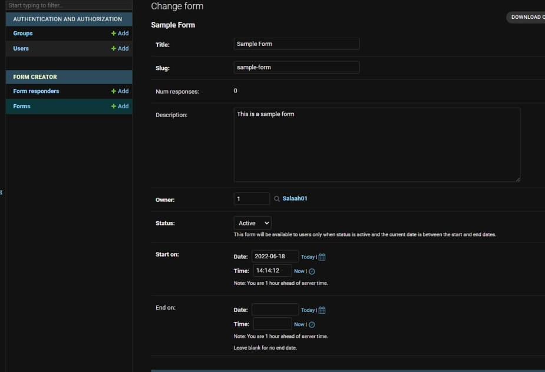
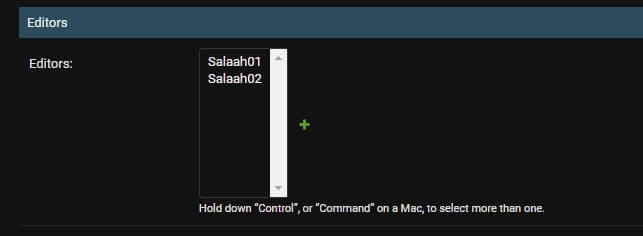
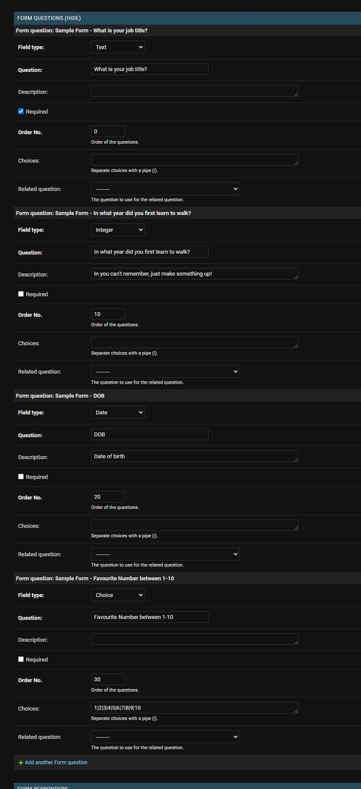
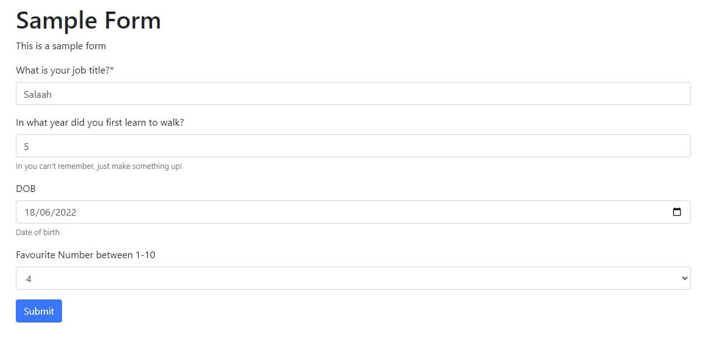

# Django Form Creator


A Django application that lets users create forms. This is achieved firstly setting up a form and form questions. The user is able to select the field type per question and thus create a form that supports various field types.

## Sections
- [Django Form Creator](#django-form-creator)
  - [Sections](#sections)
  - [What's in the box?](#whats-in-the-box)
  - [Installation](#installation)
    - [PIP install and `settings.py`](#pip-install-and-settingspy)
    - [Registering URLs](#registering-urls)
    - [Using out of the box templates](#using-out-of-the-box-templates)
  - [Usage](#usage)
    - [Creating the form](#creating-the-form)
    - [Completing the form](#completing-the-form)
  - [Contributing](#contributing)
    - [Contributing to the code](#contributing-to-the-code)

## What's in the box?
The package contains the following:
* Models to store forms, form questions and responses.
* Views to create, edit, delete and submit forms.
* Templates to render each of the views (can be overwritten with your own).
* Ability to manage forms via the admin panel.
* Endpoints to download questions and responses both directly via views and via the admin panel.

## Installation

### PIP install and `settings.py`
The application can be installed by running the following command:
```
pip install django-form-creator
```

Once installed, add the following to your `settings.py` file:
```python
INSTALLED_APPS = [
    ...
    "form_creator",
    ...
]
```

Run migrations:
```bash
python manage.py migrate
```

### Registering URLs
In your root `urls.py` file, add the following:
```python
from django.urls import path, include

urlpatterns = [
    ...
    path('form-creator/', include('form_creator.urls')),
]
```
*(Note: you don't need to call the path "form-creator/", rename this to whatever you want.)*

This will add the following URLs to your root `urls.py` file:
| URL                                              | Description                        |
| ------------------------------------------------ | ---------------------------------- |
| forms/                                           | Forms list view                    |
| forms/create/                                    | Form create view                   |
| forms/\<int:pk\>-\<slug:slug\>/                  | Form detail view                   |
| forms/\<int:pk\>-\<slug:slug\>/edit/             | Form edit view                     |
| forms/\<int:pk\>-\<slug:slug\>/delete/           | Form delete view                   |
| forms/\<int:pk\>-\<slug:slug\>/questions/edit/   | Form questions edit view           |
| forms/\<int:pk\>-\<slug:slug\>/response/         | Form for users to submit responses |
| forms/\<int:pk\>-\<slug:slug\>/export/questions/ | Export form questions as CSV       |
| forms/\<int:pk\>-\<slug:slug\>/export/responses/ | Export form responses as CSV       |

If you want to limit the available views, you can import each of the views directly. The views are located in `form_creator.views`. If you want more control over the views, you inherit from the views in `form_creator.views` and override the methods you want to change.

This might be useful when overriding templates and defining permissions.

### Using out of the box templates
The package comes with some templates to allows uses to manage and complete forms. If you wish to use these templates, you will need to download `django-crispy-forms` and update your `settings.py` file. Follow the instructions below:

```
pip install django-crispy-forms
```

In your `settings.py`:
```python
INSTALLED_APPS = [
    ...
    "crispy_forms",
    "form_creator",
    ...
]

CRISPY_TEMPLATE_PACK = "bootstrap4"
```


The included templates also make use of messages. Add the following to your `settings.py` file:

```python

from django.contrib.messages import constants as messages

MESSAGE_TAGS = {
    messages.DEBUG: "alert-secondary",
    messages.INFO: "alert-info",
    messages.SUCCESS: "alert-success",
    messages.WARNING: "alert-warning",
    messages.ERROR: "alert-danger",
}
```

## Usage
Once you have installed the application, it's time to create your first form.
You can either go to the admin panel or access the `form_creator:form_list` view to start creating your first form. The default requirement is that you are logged in as a staff member in order to create a form.

In our example, we will create a sample form via the admin panel, and then complete it via the front end.

### Creating the form
The first time to do is give your form a title and a description.

**Owner**
The form will need to have an owner. This is to allow a person to have control of the form via the `form_creator:form_detail` and `form_creator:form_edit` views. This is useful if the owner of the form is not a staff user who can manage the form via the admin panel. If this is not applicable, you can set the owner to yourself.

**Status**
There are 3 statuses to pick form: draft, active and inactive.

Setting the status to either draft or inactive would mean that users are not able to complete the form.

Setting the status to active would allow users to complete the form only if the form is within the start and end date.

**Start and end dates**

The form must have a start date and can have an end date. The start date is the date from which the form will become live. Users will only be able to complete the form from the start date if the from status is set to active.

The end date is an optional configuration. If the value is set, it means that the form has no end date. Otherwise, the form will be live until the end date.

**Editors**

The editors section is allowed to assigns users who can edit the form details and questions. They are not however able to delete the form itself.

**Setting Questions**
The next section is where you will be able to set the questions for your form. You are able to set question, any applicable choices and the field type.



### Completing the form
Users are able to navigate to the URL for `forms_creator:form_response` to complete the form.

The form generated will respect the form fields selected and any choices allowed.

Once the form is completed, they are able to press submit to submit the form.



## Contributing
If you would like to help develop this application here are a couple of things you can do:
* Raise an issue/suggestion on the [GitHub repository](https://github.com/Salaah01/django-form-creator/issues).
* Find an issue/suggestion on the [GitHub repository](https://github.com/Salaah01/django-form-creator/issues) that you would like to work on, fork the repository and start working on it! When you're ready, create a pull request on GitHub.

### Contributing to the code
1. Fork the repository and clone it to your local machine.
2. Create a new branch for your changes.
3. Create a virtual environment and install the dependencies.
```bash
python3 -m venv venv
. venv/bin/activate
pip install -r requirements.txt
```
4. `example` contains a Django project for development. Move into that directory: `cd example`
5. Run migrations: `python manage.py migrate`. As we are using an sqlite3 database, there is no need to create a database yourself.
6. Create yourself a superuser: `python manage.py createsuperuser`.
7. Run the development server: `python manage.py runserver`.
8. Write some code, don't forget to write tests.
9. Run the formatter/linter to format and lint your code:
```bash
make format
make lint
```
10. Run tests - let's try to stick to 100% coverage.
```bash
cd ..
make test-coverage
```
1.  Update the coverage on the [README.md](https://github.com/Salaah01/django-form-creator/blob/master/README.md) file: `make update_readme_cov`.
2.  Commit your changes, push them to your repository and merge into master.
3.  Create a pull request to merge into the remote repository.
